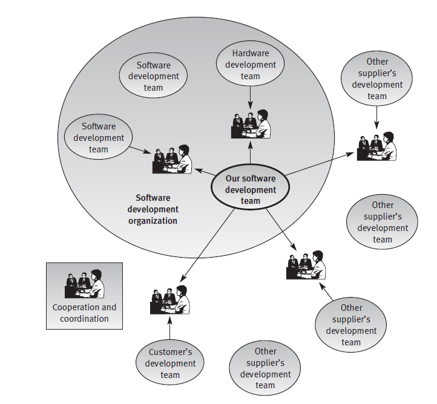
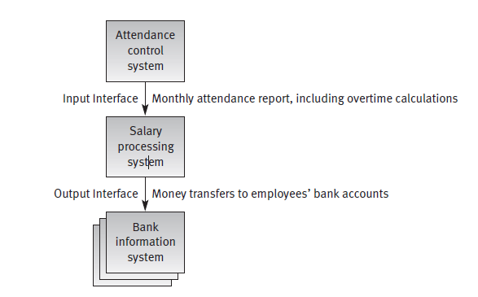

Chapter 1

# The software quality challenge

Bab 1

# Tantangan kualitas perangkat lunak

| Chapter outline | | |
| ------ | ----- | ----- |
| 1.1 | The uniqueness of software quality assurance | 4 |
| 1.2 | The environments for which SQA methods are developed | 7 |
| | Summary | 11 |
| | Review question | 12 |
| | Topics for discussion | 12 |

Two basic questions should be raised before we proceed to list the variety of
subjects and details of the book:

1.  Is it justified to devote a special book to software quality assurance (SQA) or, in other words, can we not use the general quality assurance textbooks available that are applicable to numerous areas and industries?

2.   Having decided to develop specialized books for software quality assurance, at which of the various environments of software development, from amateurs’ hobby to professionals’ work, should we aim our main efforts?
Put simply, what are the unique characteristics of the SQA environment?

Dua pertanyaan dasar harus diajukan sebelum kita melanjutkan untuk membuat daftar variasi dari topik dan detail buku:

1. Apakah dibenarkan untuk mencurahkan buku khusus untuk jaminan kualitas perangkat lunak atau, dengan kata lain, tidak bisakah kita menggunakan buku teks penjaminan mutu umum? tersedia yang berlaku untuk berbagai area dan industri?
2. Setelah memutuskan untuk mengembangkan buku khusus untuk jaminan kualitas perangkat lunak, di mana dari berbagai lingkungan pengembangan perangkat lunak, dari hobi amatir ke pekerjaan profesional, haruskah kita mengarahkan upaya utama kita? Sederhananya, apa karakteristik unik dari lingkungan SQA?

The objective of this chapter is to answer these questions by exploring the related issues.

After completing this chapter, you will be able to:
<ul>
<li> Identify the unique characteristics of software as a product and as production process that justify separate treatment of its quality issues.

<li> Recognize the characteristics of the environment where professional software development and maintenance take place.

<li> Explain the main environmental difficulties faced by software development and maintenance teams as a result of the environment in which 
they operate.</ul>

Tujuan dari bab ini adalah untuk menjawab pertanyaan-pertanyaan ini dengan mengeksplorasi masalah terkait.
Setelah menyelesaikan bab ini, Anda akan dapat:

<ul>
<li> Identifikasi karakteristik unik perangkat lunak sebagai produk dan sebagai produksi proses yang membenarkan perlakuan terpisah dari masalah kualitasnya.

<li> Kenali karakteristik lingkungan tempat perangkat lunak professional pengembangan dan pemeliharaan berlangsung.

<li> Jelaskan kesulitan lingkungan utama yang dihadapi oleh pengembangan perangkat lunak dan tim pemeliharaan sebagai akibat dari lingkungan di mana mereka beroperasi.</ul>

### 1.1 The uniqueness of software quality assurance

“Look at this,” shouted my friend while handing me **Dagal Features’s**
Limited Warranty leaflet. “Even **Dagal Features** can’t cope with software
bugs.” He pointed to a short paragraph on page 3 of the leaflet that states
the conditions of the warranty for **AMGAL**, a leading Software Master product
sold all over the world. The leaflet states the following:

1.1 Keunikan jaminan kualitas perangkat lunak
“Lihat ini,” teriak temanku sambil menyodorkan Fitur Dagal kepadaku Pamflet Garansi Terbatas. “Bahkan Fitur Dagal tidak dapat mengatasi perangkat lunak bug." Dia menunjuk ke paragraf pendek di halaman 3 dari selebaran yang menyatakan ketentuan garansi untuk AMGAL, produk Master Perangkat Lunak terkemuka dijual di seluruh dunia. Selebaran tersebut menyatakan sebagai berikut:

<ul>
LIMITED WARRANTY

**Dagal Features** provides no warranty, either expressed or implied, with
respect to **AMGAL’s** performance, reliability or fitness for any specified
purpose. **Dagal Features** does not warrant that the software or its documentation will fulfil your requirements. although **Dagal Features** has
performed thorough tests of the software and reviewed the documentation, **Dagal Features** does not provide any warranty that the software and
its documentation are free of errors. **Dagal Features** will in no case be
liable for any damages, incidental, direct, indirect or consequential,
incurred as a result of impaired data, recovery costs, profit loss and third
party claims. the software is licensed “as is”. the purchaser assumes the
complete risk stemming from application of the **AMGAL** program, its
quality and performance.

GARANSI TERBATAS

**Fitur Dagal** tidak memberikan jaminan, baik tersurat maupun tersirat, dengan sehubungan dengan kinerja, keandalan, atau kesesuaian **AMGAL** untuk semua yang ditentukan tujuan. **Fitur Dagal** tidak menjamin bahwa perangkat lunak atau dokumentasinya akan memenuhi kebutuhan Anda. meskipun **Fitur Dagal** memiliki melakukan pengujian perangkat lunak secara menyeluruh dan meninjau dokumentasi, **Fitur Dagal** tidak memberikan jaminan apa pun bahwa perangkat lunak dan dokumentasinya bebas dari kesalahan. **Fitur Dagal** tidak akan menjadi bertanggung jawab atas segala kerusakan, insidental, langsung, tidak langsung atau konsekuensial, imbul sebagai akibat dari data yang rusak, biaya pemulihan, kerugian laba, dan ketiga klaim pihak. perangkat lunak dilisensikan "sebagaimana adanya". pembeli mengasumsikan risiko lengkap yang berasal dari penerapan program AMGAL, kualitas dan kinerja.

If physical defects are discovered in the documentation or the CD on
which **AMGAL** is distributed, **Dagal Features** will replace, at no charge,
the documentation or the CD within 180 days of purchase, provided
proof of purchase is presented.

Jika cacat fisik ditemukan dalam dokumentasi atau CD di yang **AMGAL** didistribusikan, **Fitur Dagal** akan menggantikan, tanpa biaya, dokumentasi atau CD dalam waktu 180 hari setelah pembelian, asalkan bukti pembelian disajikan.</ul>

“Is the AMGAL software really so special that its developers are incapable
of meeting the challenge of assuring a bug-free product?” continued my
friend. “Do other software packages limit their warranties in the same way?”

“Apakah perangkat lunak AMGAL benar-benar istimewa sehingga pengembangnya tidak mampu memenuhi tantangan untuk memastikan produk bebas bug?” lanjut saya teman. “Apakah paket perangkat lunak lain membatasi jaminan mereka dengan cara yang sama?”

Though **Dagal Features** and AMGAL are fictitious, an examination of
the warranties offered by other software developers reveals a similar pattern.
No developer will declare that its software is free of defects, as major manufacturers of computer hardware are wont to do. This refusal actually
reflects the essential elemental differences between software and other industrial
products, such as automobiles, washing machines or radios. These differences can be categorized as follows:

Meskipun **Fitur Dagal** dan AMGAL adalah fiktif, pemeriksaan terhadap jaminan yang ditawarkan oleh pengembang perangkat lunak lain mengungkapkan pola yang sama. Tidak ada pengembang yang akan menyatakan bahwa perangkat lunaknya bebas dari cacat, karena produsen utama perangkat keras komputer yang biasa dilakukan. Penolakan ini sebenarnya mencerminkan perbedaan unsur penting antara perangkat lunak dan industri lainnya produk, seperti mobil, mesin cuci atau radio. Perbedaan ini dapat dikategorikan sebagai berikut:

1.  **Product complexity.** Product complexity can be measured by the number of operational modes the product permits. An industrial product,
even an advanced machine, does not allow for more than a few thousand modes of operation, created by the combinations of its different
machine settings. Looking at a typical software package one can find
millions of software operation possibilities. Assuring that the multitude
of operational possibilities is correctly defined and developed is a major
challenge to the software industry.

	**Kompleksitas produk**. Kompleksitas produk dapat diukur dengan angka mode operasional yang diizinkan produk. Sebuah produk industri, bahkan mesin canggih, tidak memungkinkan lebih dari beberapa ribu mode operasi, dibuat oleh kombinasi yang berbeda pengaturan mesin. Melihat paket perangkat lunak khas yang dapat ditemukan jutaan kemungkinan operasi perangkat lunak. Memastikan bahwa orang banyak kemungkinan operasional didefinisikan dengan benar dan dikembangkan adalah tantangan bagi industri perangkat lunak.

2.  **Product visibility.** Whereas the industrial products are visible, software
products are invisible. Most of the defects in an industrial product can be
detected during the manufacturing process. Moreover the absence of a
part in an industrial product is, as a rule, highly visible (imagine a door
missing from your new car). However, defects in software products
(whether stored on diskettes or CDs) are invisible, as is the fact that parts of a software package may be absent from the beginning.

	**Visibilitas produk.** Sedangkan produk industri terlihat, perangkat lunak produk tidak terlihat. Sebagian besar cacat pada produk industri dapat terdeteksi selama proses produksi. Apalagi tidak adanya bagian dalam produk industri, sebagai suatu peraturan, sangat terlihat (bayangkan sebuah pintu hilang dari mobil baru Anda). Namun, cacat pada produk perangkat lunak (apakah disimpan di disket atau CD) tidak terlihat, seperti fakta bahwa bagian-bagiannya paket perangkat lunak mungkin tidak ada sejak awal.

3.  **Product development and production process**. Let us now review the
phases at which the possibility of detecting defects in an industrial product may arise:

    **Pengembangan produk dan proses produksi**. Mari kita tinjau sekarang fase di mana kemungkinan mendeteksi cacat pada produk industry mungkin timbul:
<ul>

(a) **Product development.** In this phase the designers and quality assurance (QA) staff check and test the product prototype, in order to
detect its defects.

(a) **Pengembangan produk.** Dalam fase ini para desainer dan jaminan kualitas (QA) staf memeriksa dan menguji prototipe produk, untuk mendeteksi cacatnya.

(b) **Product production planning.** During this phase the production
process and tools are designed and prepared. In some products there
is a need for a special production line to be designed and built. This
phase thus provides additional opportunities to inspect the product,
which may reveal defects that “escaped” the reviews and tests conducted during the development phase.

(b) **Perencanaan produksi produk.** Selama fase ini produksi proses dan alat dirancang dan disiapkan. Di beberapa produk ada adalah kebutuhan akan jalur produksi khusus untuk dirancang dan dibangun. Ini fase sehingga memberikan peluang tambahan untuk memeriksa produk, yang dapat mengungkapkan cacat yang "lolos" dari ulasan dan pengujian yang dilakukan selama fase pengembangan.

(c) **Manufacturing.** At this phase QA procedures are applied to detect
failures of products themselves. Defects in the product detected in the
first period of manufacturing can usually be corrected by a change in
the product’s design or materials or in the production tools, in a way
that eliminates such defects in products manufactured in the future.

(c) **Manufaktur.** Pada fase ini, prosedur QA diterapkan untuk mendeteksi kegagalan produk itu sendiri. Cacat pada produk terdeteksi di periode pertama manufaktur biasanya dapat dikoreksi dengan perubahan desain produk atau bahan atau alat produksi, dengan cara yang menghilangkan cacat tersebut pada produk yang diproduksi di masa depan.</ul>

In comparison to industrial products, software products do not benefit
from the opportunities for detection of defects at all three phases of the
production process. The only phase when defects can be detected is the
development phase. Let us review what each phase contributes to the
detection of defects:

Dibandingkan dengan produk industri, produk perangkat lunak tidak menguntungkan
dari peluang untuk mendeteksi cacat pada ketiga fase proses produksi. Satu-satunya fase ketika cacat dapat dideteksi adalah fase pengembangan. Mari kita tinjau apa kontribusi setiap fase terhadap deteksi cacat:
<ul>

(a) **Product development.** During this phase, efforts of the development
teams and software quality assurance professionals are directed
toward detecting inherent product defects. At the end of this phase
an approved prototype, ready for reproduction, becomes available.

(a) **Pengembangan produk.** Selama fase ini, upaya pengembangan tim dan profesional jaminan kualitas perangkat lunak diarahkan untuk mendeteksi cacat produk yang melekat. Di akhir fase ini prototipe yang disetujui, siap untuk direproduksi, tersedia.

(b) **Product production planning.** This phase is not required for the software production process, as the manufacturing of software copies
and printing of software manuals are conducted automatically. This
applies to any software product, whether the number of copies is
small, as in custom-made software, or large, as in software packages
sold to the general public.

(b) **Perencanaan produksi produk.** Fase ini tidak diperlukan untuk perangkat lunak proses produksi, sebagai pembuatan salinan perangkat lunak dan pencetakan manual perangkat lunak dilakukan secara otomatis. Ini berlaku untuk produk perangkat lunak apa pun, baik jumlah salinannya kecil, seperti dalam perangkat lunak yang dibuat khusus, atau besar, seperti dalam paket perangkat lunak dijual kepada masyarakat umum.

(c) **Manufacturing.** As mentioned previously, the manufacturing of
software is limited to copying the product and printing copies of the
software manuals. Consequently, expectations for detecting defects
are quite limited during this phase.

(c) **Manufaktur.** Seperti disebutkan sebelumnya, pembuatan perangkat lunak terbatas untuk menyalin produk dan mencetak salinan dari manual perangkat lunak. Akibatnya, harapan untuk mendeteksi cacat sangat terbatas selama fase ini.
Perbedaan yang mempengaruhi deteksi cacat pada produk perangkat lunak versus produk industri lainnya ditunjukkan pada Tabel 1.1 dan Frame 1.1. 
</Ul>

The differences affecting the detection of defects in software products versus
other industrial products are shown in Table 1.1 and Frame 1.1.

Perbedaan yang mempengaruhi deteksi cacat pada produk perangkat lunak versus produk industri lainnya ditunjukkan pada Tabel 1.1 dan Frame 1.1. 

It should be noted that significant parts of advanced machinery as well
as of household machines and other products include embedded software
components (usually termed “firmware”) that are integrated into the product. These software components (the firmware) share the same
characteristics of the software products mentioned above. It follows that the comparison shown above should actually be that of software products versus other industrial products and non-software components of industrial
products that include firmware. Hereinafter, when mentioning software, we
will mean software products as well as firmware.

Perlu dicatat bahwa bagian penting dari mesin canggih juga pada mesin rumah tangga dan produk lainnya termasuk perangkat lunak tertanam komponen (biasanya disebut "firmware") yang terintegrasi ke dalam produk. Komponen perangkat lunak ini (firmware) berbagi hal yang sama karakteristik produk perangkat lunak yang disebutkan di atas. Oleh karena itu, perbandingan yang ditunjukkan di atas sebenarnya adalah produk perangkat lunak versus produk industri lainnya dan komponen non-perangkat lunak industry produk yang menyertakan firmware. Selanjutnya, ketika menyebutkan perangkat lunak, kami akan berarti produk perangkat lunak serta firmware. 

The fundamental differences between the development and production
processes related to software products and those of other industrial products warrant the creation of a different SQA methodology for software. The need for special tools and methods for the software industry is reflected in the professional publications as well in special standards devoted to SQA, such as ISO 9000-3, “Guidelines for the application of ISO 9001 to the development, supply and maintenance of software”. This point is supported by the fact
that targeted guidelines have not been prepared by ISO for other industries, 

Perbedaan mendasar antara pengembangan dan produksi proses yang terkait dengan produk perangkat lunak dan produk industri lainnya menjamin pembuatan metodologi SQA yang berbeda untuk perangkat lunak. Kebutuhan untuk alat dan metode khusus untuk industri perangkat lunak tercermin dalam professional publikasi juga dalam standar khusus yang ditujukan untuk SQA, seperti: ISO 9000-3, “Pedoman penerapan ISO 9001 untuk pengembangan, penyediaan dan pemeliharaan perangkat lunak”. Poin ini didukung oleh fakta bahwa pedoman yang ditargetkan belum disiapkan oleh ISO untuk industri lain, 

| Characteristik | Software Product | Other Industrial products |
| ---------- | --------- | ----------- |
| Complexity | Usually, very complex product allowing for very large number of operational | Degre of complexity much lower, allowing at mos a few thousand operational options | 
| visibility of product | Invisible to detect defects or omissions by sight (e.g. of a diskette or CD storing the software) | Visible product, allowing effective detection of defect by sight |
| Nature of development and production procces | Oppurtunities to detect defects arise in only one phase, namely product development | Oppurtunities to detect defect arise in all phases of development and production : <li> product development<li> product production planning<li> manufacturing |

Frame 1.1 The uniqueness of the software development process

<li> High complexity, as compared to other industrial products

<li> Invisibility of the product

<li> Opportunities to detect defects (“bugs”) are limited to the product
    development phase

and the only other targeted guidelines have been prepared for services (ISO
9004-2, “Quality management and quality systems elements: Guidelines for
the services”).

dan satu-satunya pedoman yang ditargetkan lainnya telah disiapkan untuk layanan (ISO 9004-2, “Manajemen mutu dan elemen sistem mutu: Pedoman untuk pelayanan").

The great complexity as well as invisibility of software, among other
product characteristics, make the development of SQA methodology and its
successful implementation a highly professional challenge.

Kompleksitas besar serta ketidaktampakan perangkat lunak, antara lain karakteristik produk, membuat pengembangan metodologi SQA dan keberhasilan implementasi tantangan yang sangat profesional.

### 1.2 The environments for which SQA methods are developed

### 1.2 Lingkungan di mana metode SQA berada dikembangkan

The software developed by many individuals and in different situations fulfills a variety of needs:

Perangkat lunak yang dikembangkan oleh banyak individu dan dalam situasi yang berbeda memenuhi berbagai kebutuhan:
<ul>
<li> Pupils and students develop software as part of their education.

<li> Murid dan siswa mengembangkan perangkat lunak sebagai bagian dari pendidikan mereka.

<li> Software amateurs develop software as a hobby.

<li> Amatir perangkat lunak mengembangkan perangkat lunak sebagai hobi.

<li> Professionals in engineering, economics, management and other fields
develop software to assist them in their work, to perform calculations,
summarize research and survey activities, and so forth.

<li> Profesional di bidang teknik, ekonomi, manajemen, dan bidang lainnya mengembangkan perangkat lunak untuk membantu mereka dalam pekerjaan mereka, untuk melakukan perhitungan, merangkum kegiatan penelitian dan survei, dan sebagainya. 

<li> Software development professionals (systems analysts and programmers)
develop software products or firmware as a professional career objective
while in the employment of software houses or by software development
and maintenance units (teams, departments, etc.) of large and small
industrial, financial and other organizations.

<li> Profesional pengembangan perangkat lunak (analis sistem dan pemrogram) mengembangkan produk perangkat lunak atau firmware sebagai tujuan karir professional saat bekerja di rumah perangkat lunak atau dengan pengembangan perangkat lunak dan unit pemeliharaan (tim, departemen, dll.) besar dan kecil industri, keuangan dan organisasi lainnya.
</ul>
All those who participate in these activities are required to deal with software quality problems (“bugs”). However, quality problems in their most
severe form govern the professional software development.

Semua orang yang berpartisipasi dalam kegiatan ini diharuskan untuk berurusan dengan perangkat lunak masalah kualitas ("bug"). Namun, masalah kualitas di sebagian besar mereka bentuk parah mengatur pengembangan perangkat lunak profesional.

This book is devoted, therefore, to defining and solving many of the software quality assurance (SQA) problems confronted by software development
and maintenance professionals. However, all other types of software developers can find portions of the book applicable to and recommended for their own software development efforts.

Oleh karena itu, buku ini dikhususkan untuk mendefinisikan dan memecahkan banyak perangkat lunak masalah jaminan kualitas (SQA) yang dihadapi oleh pengembangan perangkat lunak dan profesional pemeliharaan. Namun, semua jenis pengembang perangkat lunak lainnya dapat menemukan bagian-bagian dari buku yang berlaku dan direkomendasikan untuk mereka upaya pengembangan perangkat lunak sendiri.

Let us begin with the examination of the environment of professional software development and maintenance (hereafter “the SQA environment”), as it is a major consideration in the development of SQA methodologies and their implementation. The main characteristics of this environment are as follows:

Mari kita mulai dengan pemeriksaan lingkungan perangkat lunak professional pengembangan dan pemeliharaan (selanjutnya disebut "lingkungan SQA"), karena adalah pertimbangan utama dalam pengembangan metodologi SQA dan penerapan. Ciri-ciri utama dari lingkungan ini adalah sebagai berikut:

1. Contractual conditions. As a result of the commitments and conditions
defined in the contract between the software developer and the customer,
the activities of software development and maintenance need to cope with:

    Kondisi kontrak. Sebagai hasil dari komitmen dan kondisi didefinisikan dalam kontrak antara pengembang perangkat lunak dan pelanggan, kegiatan pengembangan dan pemeliharaan perangkat lunak perlu mengatasi:
<ul>
<li> A defined list of functional requirements that the developed software
and its maintenance need to fulfill.

<li> Daftar persyaratan fungsional yang ditentukan oleh perangkat lunak yang dikembangkan dan pemeliharaannya harus dipenuhi.

<li> The project budget.

<li> Angaran proyek.

<li> The project timetable.

<li> Jadwal proyek.
</ul>
The managers of software development and maintenance projects need
to invest a considerable amount of effort in the oversight of activities in
order to meet the contract’s requirements.
Manajer proyek pengembangan dan pemeliharaan perangkat lunak membutuhkan untuk menginvestasikan sejumlah besar upaya dalam pengawasan kegiatan di untuk memenuhi persyaratan kontrak.

2. Subjection to customer–supplier relationship. Throughout the process of
software development and maintenance, activities are under the oversight
of the customer. The project team has to cooperate continuously with the customer: to consider his request for changes, to discuss his criticisms about the various aspects of the project, and to get his approval for changes initiated by the development team. Such relationships do not usually exist when software is developed by non-software professionals.

    Tunduk pada hubungan pelanggan-pemasok. Sepanjang proses pengembangan dan pemeliharaan perangkat lunak, kegiatan berada di bawah pengawasan dari pelanggan. Tim proyek harus bekerja sama terus menerus dengan pelanggan: untuk mempertimbangkan permintaannya untuk perubahan, untuk mendiskusikan kritiknya tentang berbagai aspek proyek, dan untuk mendapatkan persetujuannya untuk perubahan yang diprakarsai oleh tim pengembangan. Hubungan seperti itu tidak biasanya ada ketika perangkat lunak dikembangkan oleh profesional non-perangkat lunak.

3. Required teamwork. Three factors usually motivate the establishment of
a project team rather than assigning the project to one professional:
    Diperlukan kerja tim. Tiga faktor biasanya memotivasi pembentukan tim proyek daripada menugaskan proyek ke satu profesional:
<ul>
<li> Timetable requirements. In other words, the workload undertaken during the project period requires the participation of more than one person if the project is to be completed on time.

<li> Persyaratan jadwal. Dengan kata lain, beban kerja yang dilakukan selama periode proyek membutuhkan partisipasi lebih dari satu orang jika proyek harus diselesaikan tepat waktu.

<li> The need for a variety of specializations in order to carry out the project.

<li> Kebutuhan akan berbagai spesialisasi untuk melaksanakan proyek.

<li> The wish to benefit from professional mutual support and review for
the enhancement of project quality.

<li> Keinginan untuk mendapatkan manfaat dari saling mendukung dan meninjau secara profesional untuk peningkatan kualitas proyek.
</ul>

4. Cooperation and coordination with other software teams. The carryingout
of projects, especially large-scale projects, by more than one team is a very common event in the software industry. In these cases, cooperation
may be required with:

    Kerjasama dan koordinasi dengan tim perangkat lunak lain. Pelaksanaannya proyek, terutama proyek skala besar, oleh lebih dari satu tim adalah peristiwa yang sangat umum di industri perangkat lunak. Dalam hal ini, kerjasama mungkin diperlukan dengan:
<ul>
<li> Other software development teams in the same organization.

<li> Tim pengembangan perangkat lunak lain dalam organisasi yang sama.

<li> Hardware development teams in the same organization.

<li> Tim pengembangan perangkat keras dalam organisasi yang sama.

<li> Software and hardware development teams of other suppliers.

<li> Tim pengembangan perangkat lunak dan perangkat keras dari pemasok lain.

<li> Customer software and hardware development teams that take part
in the project’s development.

<li> Tim pengembangan perangkat lunak dan perangkat keras pelanggan yang ambil bagian dalam pengembangan proyek.
</ul>

An outline of cooperation needs, as seen from the perspective of the
development team, is shown in Figure 1.1.

Garis besar kebutuhan kerjasama, dilihat dari sudut pandang tim pengembang, ditunjukkan pada Gambar 1.1.

5. Interfaces with other software systems. Nowadays, most software systems
include interfaces with other software packages. These interfaces allow data in electronic form to flow between the software systems, free from keying in of data processed by the other software systems. One can identify the following main types of interfaces:

    Antarmuka dengan sistem perangkat lunak lain. Saat ini, sebagian besar sistem perangkat lunak menyertakan antarmuka dengan paket perangkat lunak lain. Antarmuka ini memungkinkan data dalam bentuk elektronik mengalir di antara sistem perangkat lunak, gratis dari memasukkan data yang diproses oleh sistem perangkat lunak lain. Satu bias mengidentifikasi jenis antarmuka utama berikut:
<ul>
<li> Input interfaces, where other software systems transmit data to your
software system.

<li> Antarmuka input, di mana sistem perangkat lunak lain mengirimkan data ke sistem perangkat lunak.

<li> Output interfaces, where your software system transmits processed
data to other software systems.

<li> Antarmuka keluaran, tempat sistem perangkat lunak Anda mentransmisikan proses data ke sistem perangkat lunak lain.

<li> Input and output interfaces to the machine’s control board, as in medical
and laboratory control systems, metal processing equipment, etc.

<li> Antarmuka input dan output ke papan kontrol mesin, seperti dalam medis dan sistem kontrol laboratorium, peralatan pemrosesan logam, dll.
</ul> 

Salary processing software packages provide good examples of typical input and output interfaces to other software packages – see Figure 1.2. First let us look at the input interface. In order to calculate salaries, one needs the employees’ attendance information, as captured by the time 

**Figure 1.1 : A cooperation and coordination scheme for a software development team of a largescale
project**

clocks placed at the entrance to the office building and processed later by the attendance control software system. Once a month, this information (the attendance lists including the overtime data) is transmitted electronically from the attendance control system to the salary processing system. This information transmission represents an input interface for the salary processing software system; at the same time it represents an output interface to the attendance control system. Now, let us examine the output interface of our system. One of the outputs of the salary processing system is the list of “net” salaries, after deduction of the income tax and other items, payable to the employees. This list, including the employees’ bank account details, has to be sent to the banks. The transmission of the list of salary payments is done electronically, representing an output interface for the salary processing system and an input interface for the bank’s account system.

**Figure 1.2 : The salary software system – an example of software interfaces**

Paket perangkat lunak pengolah gaji memberikan contoh yang baik dari tipikal antarmuka input dan output ke paket perangkat lunak lain – lihat Gambar 1.2. Pertama mari kita lihat antarmuka input. Untuk menghitung gaji, satu membutuhkan informasi kehadiran karyawan, seperti yang ditangkap oleh waktu jam ditempatkan di pintu masuk gedung kantor dan diproses nanti oleh sistem perangkat lunak kontrol kehadiran. Sebulan sekali, informasi ini (daftar kehadiran termasuk data lembur) ditransmisikan secara elektronik dari sistem kontrol kehadiran hingga pemrosesan gaji sistem. Transmisi informasi ini mewakili antarmuka input
untuk sistem perangkat lunak pengolah gaji; pada saat yang sama itu mewakili antarmuka output ke sistem kontrol kehadiran. Sekarang, mari kita periksa antarmuka keluaran sistem kami. Salah satu output dari gaji sistem pemrosesan adalah daftar gaji "bersih", setelah dikurangi pajak penghasilan dan hal-hal lain yang harus dibayarkan kepada karyawan. Daftar ini, termasuk rincian rekening bank karyawan, harus dikirim ke bank. Itu transmisi daftar pembayaran gaji dilakukan secara elektronik, yang mewakili antarmuka output untuk sistem pemrosesan gaji dan input antarmuka untuk sistem rekening bank. 

1. The need to continue carrying out a project despite team member
changes. It is quite common for team members to leave the team during
the project development period, whether owing to promotions to higher
level jobs, a switch in employers, transfers to another city, and so forth.
The team leader then has to replace the departing team member either
by another employee or by a newly recruited employee. No matter how
much effort is invested in training the new team member, “the show
must go on”, which means that the original project contract timetable
will not change.

    Kebutuhan untuk terus melaksanakan proyek meskipun ada anggota tim perubahan. Sangat umum bagi anggota tim untuk meninggalkan tim selama periode pengembangan proyek, baik karena promosi ke yang lebih tinggi pekerjaan tingkat, beralih majikan, transfer ke kota lain, dan sebagainya. Pemimpin tim kemudian harus mengganti anggota tim yang pergi juga oleh karyawan lain atau oleh karyawan yang baru direkrut. Bagaimanapun caranya banyak upaya diinvestasikan dalam melatih anggota tim baru, "pertunjukan" harus dilanjutkan”, yang berarti jadwal kontrak proyek asli tidak akan berubah.

7. The need to continue carrying out software maintenance for an extended
period. Customers who develop or purchase a software system expect
to continue utilizing it for a long period, usually for 5–10 years. During
the service period, the need for maintenance will eventually arise. In
most cases, the developer is required to supply these services directly.
Internal “customers”, in cases where the software has been developed
in-house, share the same expectation regarding the software maintenance
during the service period of the software system.

    Kebutuhan untuk terus melakukan pemeliharaan perangkat lunak untuk waktu yang lama Titik. Pelanggan yang mengembangkan atau membeli sistem perangkat lunak mengharapkan untuk terus menggunakannya untuk waktu yang lama, biasanya selama 5-10 tahun. Selama masa layanan, kebutuhan akan pemeliharaan pada akhirnya akan muncul. Di kebanyakan kasus, pengembang diharuskan untuk menyediakan layanan ini secara langsung. “Pelanggan” internal, dalam kasus di mana perangkat lunak telah dikembangkan in-house, berbagi harapan yang sama mengenai pemeliharaan perangkat lunak selama periode layanan sistem perangkat lunak.

The environmental characteristics create a need for intensive and continuous
managerial efforts parallel to the professional efforts that have to be invested in order to assure the project’s quality, in other words to assure the project’s success.

Karakteristik lingkungan menciptakan kebutuhan yang intensif dan berkesinambungan upaya manajerial sejajar dengan upaya profesional yang harus diinvestasikan untuk menjamin kualitas proyek, dengan kata lain untuk menjamin
keberhasilan proyek.

A significant amount of software as well as firmware development is not
carried out subject to formal contracts or formal customer–supplier relationships, as mentioned in the first two SQA environment characteristics. This type of activity usually concerns software developed in-house for internal use or for marketing as software packages and in-house development of firmware.
The relationships between the marketing department that initiates and
defines the qualifications of a new product and the respective in-house software
development department often resemble a contract and customer–
supplier relationship. The same applies to internal requests for a new software
system or for the upgrading of current software or firmware to be
implemented by the organization’s software department. Actual relationships
between the internal “customers” and the development departments
are found to vary greatly when measured by a formal–informal scale. Some
managers claim that the closer the relationships to the formal form, the
greater the prospects for the project’s success.

Sejumlah besar perangkat lunak serta pengembangan firmware tidak dilakukan dengan tunduk pada kontrak formal atau hubungan formal pelanggan-pemasok, seperti yang disebutkan dalam dua karakteristik lingkungan SQA pertama. Ini jenis aktivitas biasanya menyangkut perangkat lunak yang dikembangkan sendiri untuk penggunaan internal atau untuk pemasaran sebagai paket perangkat lunak dan pengembangan firmware internal. Hubungan antaiyra departemen pemasaran yang memulai dan mendefinisikan kualifikasi produk baru dan perangkat lunak internal masing-masing departemen pengembangan sering menyerupai kontrak dan pelanggan- hubungan pemasok. Hal yang sama berlaku untuk permintaan internal untuk perangkat lunak baru sistem atau untuk meningkatkan perangkat lunak atau firmware saat ini menjadi diimplementasikan oleh departemen perangkat lunak organisasi. Hubungan yang sebenarnya antara "pelanggan" internal dan departemen pengembangan ditemukan sangat bervariasi ketika diukur dengan skala formal-informal. Beberapa manajer mengklaim bahwa semakin dekat hubungan dengan bentuk formal, semakin besar prospek keberhasilan proyek.
